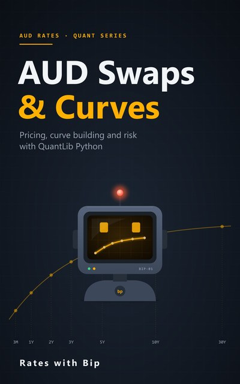

# AUD Swaps & Curves



Pricing, curve building and risk for Australian dollar interest rate swaps, with QuantLib Python.
9 episodes, a notebook for each, and a book that goes with them.

Every number in the videos and the book is computed by these notebooks.

## Episodes

| # | Episode | Notebook | |
|---|---|---|---|
| 1 | **The AUD Rates Landscape**<br>The cash rate, AONIA and BBSW, and which products use them | [ep01_aud_rates_landscape.ipynb](notebooks/ep01_aud_rates_landscape.ipynb) | [](https://colab.research.google.com/github/RatesWithBip/curriculum/blob/main/aud-swaps-and-curves/notebooks/ep01_aud_rates_landscape.ipynb) |
| 2 | **How an AONIA Swap Pays**<br>Real RBA fixings, compounded by hand, in QuantLib, and against the RBA's own index | [ep02_aonia_compounding.ipynb](notebooks/ep02_aonia_compounding.ipynb) | [](https://colab.research.google.com/github/RatesWithBip/curriculum/blob/main/aud-swaps-and-curves/notebooks/ep02_aonia_compounding.ipynb) |
| 3 | **Bootstrapping the AONIA Curve**<br>AUD OIS conventions, a hand check, and your first DV01 | [ep03_aonia_bootstrap.ipynb](notebooks/ep03_aonia_bootstrap.ipynb) | [](https://colab.research.google.com/github/RatesWithBip/curriculum/blob/main/aud-swaps-and-curves/notebooks/ep03_aonia_bootstrap.ipynb) |
| 4 | **BBSW Swaps**<br>Quarterly swaps against 3-month BBSW, the par rate, and the annuity | [ep04_bbsw_swaps.ipynb](notebooks/ep04_bbsw_swaps.ipynb) | [](https://colab.research.google.com/github/RatesWithBip/curriculum/blob/main/aud-swaps-and-curves/notebooks/ep04_bbsw_swaps.ipynb) |
| 5 | **Dual-Curve Pricing**<br>Forecast on BBSW, discount on AONIA: what changes and what doesn't | [ep05_dual_curve.ipynb](notebooks/ep05_dual_curve.ipynb) | [](https://colab.research.google.com/github/RatesWithBip/curriculum/blob/main/aud-swaps-and-curves/notebooks/ep05_dual_curve.ipynb) |
| 6 | **Basis Swaps**<br>3s6s and AONIA/BBSW basis swaps, and the curve family they build | [ep06_basis_swaps.ipynb](notebooks/ep06_basis_swaps.ipynb) | [](https://colab.research.google.com/github/RatesWithBip/curriculum/blob/main/aud-swaps-and-curves/notebooks/ep06_basis_swaps.ipynb) |
| 7 | **Valuing a Live Swap**<br>Past fixings, forecast rates, and clean vs dirty value | [ep07_seasoned_swap.ipynb](notebooks/ep07_seasoned_swap.ipynb) | [](https://colab.research.google.com/github/RatesWithBip/curriculum/blob/main/aud-swaps-and-curves/notebooks/ep07_seasoned_swap.ipynb) |
| 8 | **Risk I: DV01**<br>Par DV01, zero DV01, PV01, and how far one number goes | [ep08_dv01.ipynb](notebooks/ep08_dv01.ipynb) | [](https://colab.research.google.com/github/RatesWithBip/curriculum/blob/main/aud-swaps-and-curves/notebooks/ep08_dv01.ipynb) |
| 9 | **Risk II: Bucketed Delta**<br>Where along the curve the risk sits, how to hedge it, and what's left | [ep09_bucketed_delta.ipynb](notebooks/ep09_bucketed_delta.ipynb) | [](https://colab.research.google.com/github/RatesWithBip/curriculum/blob/main/aud-swaps-and-curves/notebooks/ep09_bucketed_delta.ipynb) |

## The book

[**AUD Swaps & Curves** (PDF, 60 pages)](book/AUD-Swaps-and-Curves.pdf): one chapter per episode, with the derivations, the hand
checks next to QuantLib's results, and the sources for every market convention.

## Run the notebooks

**In Google Colab**, nothing to install: click its **Open in Colab** button above. The first cells install QuantLib 1.43 and write
the data the notebook reads. Then run the cells in order.

**On your own computer:**

```bash
pip install -r requirements.txt
jupyter lab notebooks/
```

Tested with Python 3.14, QuantLib 1.43, pandas 3.0, numpy 2.5 and matplotlib 3.11. Running a notebook writes its data
files and an `outputs.json` next to it; git ignores them.

## Data

- The swap, FRA, basis and BBSW quotes are illustrative, made up for teaching. They are not market data.
- Episodes 1 and 2 use the cash rate target, the cash rate (AONIA) and the Cash Rate Total Return Index from the
  Reserve Bank of Australia's Statistical Table F1. Source: RBA 2026. The RBA publishes these data free of charge
  and does not endorse this material.

## Sources

Market conventions follow AFMA's *Interest Rate Derivative Conventions*, the RBA, ASX's *BBSW Conventions and
Methodology* and the Basel Framework (MAR21). Each chapter of the book lists the sources it relies on. Conventions
change: check the current documents before relying on them.

## Licence

The notebooks are under the [MIT licence](../LICENSE). The book and its cover are under
[CC BY-NC-ND 4.0](../LICENSE-BOOKS.md): share them freely, unchanged, with credit, for non-commercial purposes.
The RBA data in Episodes 1 and 2 remains subject to the RBA's own terms.

## Support

Everything here is free and stays free. If it helped you, you can buy Bip a coffee:

[](https://ko-fi.com/rateswithbip)

## Disclaimer

For education only. Nothing here is financial, investment, legal or tax advice.
