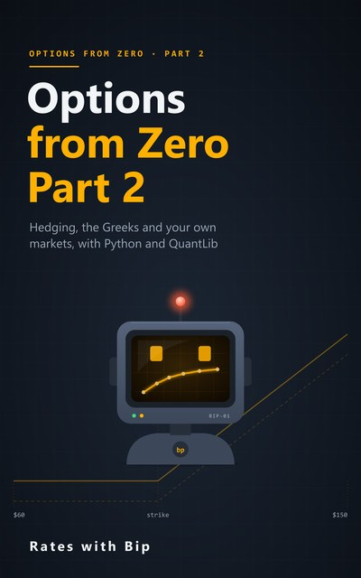

# Options from Zero



Options from the very beginning, with Python and QuantLib. No options, calculus or probability assumed.

**Part 1** (Episodes 1-10): calls and puts, arbitrage, put-call parity, binomial trees, risk-neutral probability,
American options, volatility and the Black-Scholes formula.
**Part 2** (Episodes 11-21): Brownian motion and Itô's lemma, the Black-Scholes equation from hedging, the Greeks and
explaining P&L, Monte Carlo, hedging and implied volatility, and options on AUD/USD and on BBSW.
Part 3 (the volatility smile and its models) follows.

Each episode has a notebook here, and each part a book. Every number in the videos and the books is computed by these notebooks.

## Part 1: from payoffs to Black-Scholes

| # | Episode | Notebook | |
|---|---|---|---|
| 1 | **Options Are Insurance**<br>Calls, puts, payoff and profit | [s3e01_options_are_insurance.ipynb](notebooks/s3e01_options_are_insurance.ipynb) | [](https://colab.research.google.com/github/RatesWithBip/curriculum/blob/main/options-from-zero/notebooks/s3e01_options_are_insurance.ipynb) |
| 2 | **Maths Pit Stop: exp and log**<br>Continuous compounding, discounting and logs | [s3e02_exp_and_log.ipynb](notebooks/s3e02_exp_and_log.ipynb) | [](https://colab.research.google.com/github/RatesWithBip/curriculum/blob/main/options-from-zero/notebooks/s3e02_exp_and_log.ipynb) |
| 3 | **Why the Price Is Not the Expected Value**<br>Arbitrage and the one fair price | [s3e03_price_not_expected_value.ipynb](notebooks/s3e03_price_not_expected_value.ipynb) | [](https://colab.research.google.com/github/RatesWithBip/curriculum/blob/main/options-from-zero/notebooks/s3e03_price_not_expected_value.ipynb) |
| 4 | **Forwards and Put-Call Parity**<br>The first price that needs no model | [s3e04_put_call_parity.ipynb](notebooks/s3e04_put_call_parity.ipynb) | [](https://colab.research.google.com/github/RatesWithBip/curriculum/blob/main/options-from-zero/notebooks/s3e04_put_call_parity.ipynb) |
| 5 | **The One-Step Tree**<br>Copy the option, price the option | [s3e05_one_step_tree.ipynb](notebooks/s3e05_one_step_tree.ipynb) | [](https://colab.research.google.com/github/RatesWithBip/curriculum/blob/main/options-from-zero/notebooks/s3e05_one_step_tree.ipynb) |
| 6 | **Risk-Neutral Probability**<br>Fake odds, real prices | [s3e06_risk_neutral_probability.ipynb](notebooks/s3e06_risk_neutral_probability.ipynb) | [](https://colab.research.google.com/github/RatesWithBip/curriculum/blob/main/options-from-zero/notebooks/s3e06_risk_neutral_probability.ipynb) |
| 7 | **Many Steps, and American Options**<br>Backward induction and early exercise | [s3e07_many_steps_american.ipynb](notebooks/s3e07_many_steps_american.ipynb) | [](https://colab.research.google.com/github/RatesWithBip/curriculum/blob/main/options-from-zero/notebooks/s3e07_many_steps_american.ipynb) |
| 8 | **Maths Pit Stop: the Bell Curve**<br>Mean, standard deviation and N(x) | [s3e08_bell_curve.ipynb](notebooks/s3e08_bell_curve.ipynb) | [](https://colab.research.google.com/github/RatesWithBip/curriculum/blob/main/options-from-zero/notebooks/s3e08_bell_curve.ipynb) |
| 9 | **What Volatility Is**<br>From tree to bell curve, and real AUD/USD data | [s3e09_what_is_volatility.ipynb](notebooks/s3e09_what_is_volatility.ipynb) | [](https://colab.research.google.com/github/RatesWithBip/curriculum/blob/main/options-from-zero/notebooks/s3e09_what_is_volatility.ipynb) |
| 10 | **The Black-Scholes Formula, Decoded**<br>Every term, explained | [s3e10_black_scholes_decoded.ipynb](notebooks/s3e10_black_scholes_decoded.ipynb) | [](https://colab.research.google.com/github/RatesWithBip/curriculum/blob/main/options-from-zero/notebooks/s3e10_black_scholes_decoded.ipynb) |

## Part 2: hedging, the Greeks and your own markets

| # | Episode | Notebook | |
|---|---|---|---|
| 11 | **Random Walks and Brownian Motion**<br>The maths of wiggles | [s3e11_brownian_motion.ipynb](notebooks/s3e11_brownian_motion.ipynb) | [](https://colab.research.google.com/github/RatesWithBip/curriculum/blob/main/options-from-zero/notebooks/s3e11_brownian_motion.ipynb) |
| 12 | **Slopes, Curvature and Taylor Series**<br>Maths pit stop: where gamma lives | [s3e12_taylor.ipynb](notebooks/s3e12_taylor.ipynb) | [](https://colab.research.google.com/github/RatesWithBip/curriculum/blob/main/options-from-zero/notebooks/s3e12_taylor.ipynb) |
| 13 | **Itô's Lemma, Without the Pain**<br>Why volatility drags the typical outcome down | [s3e13_ito.ipynb](notebooks/s3e13_ito.ipynb) | [](https://colab.research.google.com/github/RatesWithBip/curriculum/blob/main/options-from-zero/notebooks/s3e13_ito.ipynb) |
| 14 | **The Black-Scholes Equation from Hedging**<br>Hedge away the randomness | [s3e14_bs_pde.ipynb](notebooks/s3e14_bs_pde.ipynb) | [](https://colab.research.google.com/github/RatesWithBip/curriculum/blob/main/options-from-zero/notebooks/s3e14_bs_pde.ipynb) |
| 15 | **Delta, Gamma, Theta**<br>The dials on a trader's screen | [s3e15_delta_gamma_theta.ipynb](notebooks/s3e15_delta_gamma_theta.ipynb) | [](https://colab.research.google.com/github/RatesWithBip/curriculum/blob/main/options-from-zero/notebooks/s3e15_delta_gamma_theta.ipynb) |
| 16 | **Vega, Rho, and Explaining a Day's P&L**<br>If you can't explain it, you don't know your risk | [s3e16_pnl_attribution.ipynb](notebooks/s3e16_pnl_attribution.ipynb) | [](https://colab.research.google.com/github/RatesWithBip/curriculum/blob/main/options-from-zero/notebooks/s3e16_pnl_attribution.ipynb) |
| 17 | **Monte Carlo Pricing**<br>Simulate, pay, discount, average | [s3e17_monte_carlo.ipynb](notebooks/s3e17_monte_carlo.ipynb) | [](https://colab.research.google.com/github/RatesWithBip/curriculum/blob/main/options-from-zero/notebooks/s3e17_monte_carlo.ipynb) |
| 18 | **Hedging in Practice: Implied vs Realised Volatility**<br>Hedged options trade volatility, not direction | [s3e18_hedging_vol.ipynb](notebooks/s3e18_hedging_vol.ipynb) | [](https://colab.research.google.com/github/RatesWithBip/curriculum/blob/main/options-from-zero/notebooks/s3e18_hedging_vol.ipynb) |
| 19 | **Implied Volatility: The Price Is Quoted as a Vol**<br>Run the formula backwards | [s3e19_implied_volatility.ipynb](notebooks/s3e19_implied_volatility.ipynb) | [](https://colab.research.google.com/github/RatesWithBip/curriculum/blob/main/options-from-zero/notebooks/s3e19_implied_volatility.ipynb) |
| 20 | **FX Options: Garman-Kohlhagen**<br>Black-Scholes for the Australian dollar | [s3e20_fx_options.ipynb](notebooks/s3e20_fx_options.ipynb) | [](https://colab.research.google.com/github/RatesWithBip/curriculum/blob/main/options-from-zero/notebooks/s3e20_fx_options.ipynb) |
| 21 | **Rates Options: Black-76 and Bachelier**<br>Caplets on BBSW | [s3e21_caps_black_bachelier.ipynb](notebooks/s3e21_caps_black_bachelier.ipynb) | [](https://colab.research.google.com/github/RatesWithBip/curriculum/blob/main/options-from-zero/notebooks/s3e21_caps_black_bachelier.ipynb) |

## The books

- [**Options from Zero, Part 1** (PDF, 43 pages)](book/Options-from-Zero-Part-1.pdf): one chapter per episode of Part 1, with the derivations, the hand checks next to QuantLib's results, a glossary, and the Part 1 checkpoint with worked answers.
- [**Options from Zero, Part 2** (PDF, 43 pages)](book/Options-from-Zero-Part-2.pdf): one chapter per episode of Part 2: Brownian motion and Itô, the Black-Scholes equation from hedging, the Greeks and P&L attribution, Monte Carlo, hedging and implied volatility, Garman-Kohlhagen and Black/Bachelier caplets, with a glossary and the Part 2 checkpoint.

## Run the notebooks

**In Google Colab**, nothing to install: click its **Open in Colab** button above. The first cell installs
QuantLib 1.43, and notebooks that read data files write them first. Then run the cells in order.

**On your own computer:**

```bash
pip install -r requirements.txt
jupyter lab notebooks/
```

Tested with Python 3.14, QuantLib 1.43, pandas 3.0, numpy 2.5 and matplotlib 3.11. Running a notebook writes an
`outputs.json` (and any data files) next to it; git ignores them. Simulations use fixed random seeds, so they repeat
exactly.

## Data

- The share, its option prices, its volatility and the interest rate are illustrative, made up for teaching.
  They are not market data.
- Episodes 20-21 use the illustrative AONIA, BBSW, SOFR and AUD/USD quotes of the other two courses (the notebooks
  write the quote files). They are not market data.
- Episodes 9 and 19 use the AUD/USD noon buying rates in New York from the Federal Reserve Board's H.10 release.
  Source: Board of Governors of the Federal Reserve System.

## Sources

Facts about listed options follow ASX's published material; the history in Episode 10 follows the Royal Swedish
Academy of Sciences' 1997 press release; AUD/USD option conventions follow Reiswich and Wystup (2009); the history of
negative policy rates follows the European Central Bank's and the Bank of Japan's own publications. Each chapter of the
books lists the sources it relies on.

## Licence

The notebooks are under the [MIT licence](../LICENSE). The books and their covers are under
[CC BY-NC-ND 4.0](../LICENSE-BOOKS.md): share them freely, unchanged, with credit, for non-commercial purposes.
The Federal Reserve Board data in Episodes 9 and 19 remain subject to the Board's terms.

## Support

Everything here is free and stays free. If it helped you, you can buy Bip a coffee:

[](https://ko-fi.com/rateswithbip)

## Disclaimer

For education only. Nothing here is financial, investment, legal or tax advice. Options are risky: a seller can
lose far more than the premium received.
