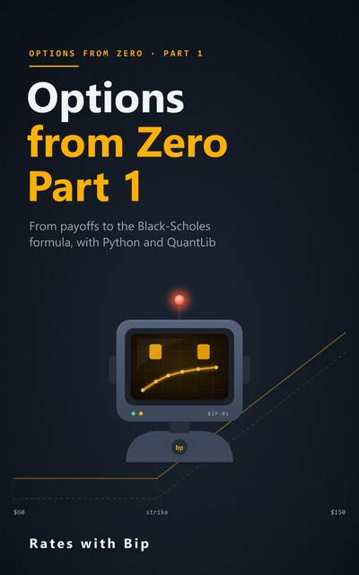

# Options from Zero



Options from the very beginning: calls and puts, arbitrage, put-call parity, binomial trees, risk-neutral
probability, American options, volatility and the Black-Scholes formula, with Python and QuantLib. No options,
calculus or probability assumed.

**Part 1** (10 episodes) is published: a notebook for each, and a book that goes with them.
Parts 2 and 3 (hedging and the Greeks; the volatility smile and its models) follow.

Every number in the videos and the book is computed by these notebooks.

## Part 1 episodes

| # | Episode | Notebook | |
|---|---|---|---|
| 1 | **Options Are Insurance**<br>Calls, puts, payoff and profit | [s3e01_options_are_insurance.ipynb](notebooks/s3e01_options_are_insurance.ipynb) | [](https://colab.research.google.com/github/RatesWithBip/curriculum/blob/main/options-from-zero/notebooks/s3e01_options_are_insurance.ipynb) |
| 2 | **Maths Pit Stop: exp and log**<br>Continuous compounding, discounting and logs | [s3e02_exp_and_log.ipynb](notebooks/s3e02_exp_and_log.ipynb) | [](https://colab.research.google.com/github/RatesWithBip/curriculum/blob/main/options-from-zero/notebooks/s3e02_exp_and_log.ipynb) |
| 3 | **Why the Price Is Not the Expected Value**<br>Arbitrage and the one fair price | [s3e03_price_not_expected_value.ipynb](notebooks/s3e03_price_not_expected_value.ipynb) | [](https://colab.research.google.com/github/RatesWithBip/curriculum/blob/main/options-from-zero/notebooks/s3e03_price_not_expected_value.ipynb) |
| 4 | **Forwards and Put-Call Parity**<br>The first price that needs no model | [s3e04_put_call_parity.ipynb](notebooks/s3e04_put_call_parity.ipynb) | [](https://colab.research.google.com/github/RatesWithBip/curriculum/blob/main/options-from-zero/notebooks/s3e04_put_call_parity.ipynb) |
| 5 | **The One-Step Tree**<br>Copy the option, price the option | [s3e05_one_step_tree.ipynb](notebooks/s3e05_one_step_tree.ipynb) | [](https://colab.research.google.com/github/RatesWithBip/curriculum/blob/main/options-from-zero/notebooks/s3e05_one_step_tree.ipynb) |
| 6 | **Risk-Neutral Probability**<br>Fake odds, real prices | [s3e06_risk_neutral_probability.ipynb](notebooks/s3e06_risk_neutral_probability.ipynb) | [](https://colab.research.google.com/github/RatesWithBip/curriculum/blob/main/options-from-zero/notebooks/s3e06_risk_neutral_probability.ipynb) |
| 7 | **Many Steps, and American Options**<br>Backward induction and early exercise | [s3e07_many_steps_american.ipynb](notebooks/s3e07_many_steps_american.ipynb) | [](https://colab.research.google.com/github/RatesWithBip/curriculum/blob/main/options-from-zero/notebooks/s3e07_many_steps_american.ipynb) |
| 8 | **Maths Pit Stop: the Bell Curve**<br>Mean, standard deviation and N(x) | [s3e08_bell_curve.ipynb](notebooks/s3e08_bell_curve.ipynb) | [](https://colab.research.google.com/github/RatesWithBip/curriculum/blob/main/options-from-zero/notebooks/s3e08_bell_curve.ipynb) |
| 9 | **What Volatility Is**<br>From tree to bell curve, and real AUD/USD data | [s3e09_what_is_volatility.ipynb](notebooks/s3e09_what_is_volatility.ipynb) | [](https://colab.research.google.com/github/RatesWithBip/curriculum/blob/main/options-from-zero/notebooks/s3e09_what_is_volatility.ipynb) |
| 10 | **The Black-Scholes Formula, Decoded**<br>Every term, explained | [s3e10_black_scholes_decoded.ipynb](notebooks/s3e10_black_scholes_decoded.ipynb) | [](https://colab.research.google.com/github/RatesWithBip/curriculum/blob/main/options-from-zero/notebooks/s3e10_black_scholes_decoded.ipynb) |

## The book

[**Options from Zero, Part 1** (PDF, 43 pages)](book/Options-from-Zero-Part-1.pdf): one chapter per episode, with the derivations, the
hand checks next to QuantLib's results, a glossary, and the Part 1 checkpoint with worked answers.

## Run the notebooks

**In Google Colab**, nothing to install: click its **Open in Colab** button above. The first cell installs
QuantLib 1.43 (Episode 9 also writes its data file). Then run the cells in order.

**On your own computer:**

```bash
pip install -r requirements.txt
jupyter lab notebooks/
```

Tested with Python 3.14, QuantLib 1.43, pandas 3.0, numpy 2.5 and matplotlib 3.11. Running a notebook writes an
`outputs.json` (and any data files) next to it; git ignores them.

## Data

- The share, its option prices, its volatility and the interest rate are illustrative, made up for teaching.
  They are not market data.
- Episode 9 uses the AUD/USD noon buying rates in New York from the Federal Reserve Board's H.10 release.
  Source: Board of Governors of the Federal Reserve System.

## Sources

Facts about listed options follow ASX's published material; the history in Episode 10 follows the Royal Swedish
Academy of Sciences' 1997 press release and Cox, Ross and Rubinstein (1979). Each chapter of the book lists the
sources it relies on.

## Licence

The notebooks are under the [MIT licence](../LICENSE). The book and its cover are under
[CC BY-NC-ND 4.0](../LICENSE-BOOKS.md): share them freely, unchanged, with credit, for non-commercial purposes.
The Federal Reserve Board data in Episode 9 remain subject to the Board's terms.

## Support

Everything here is free and stays free. If it helped you, you can buy Bip a coffee:

[](https://ko-fi.com/rateswithbip)

## Disclaimer

For education only. Nothing here is financial, investment, legal or tax advice. Options are risky: a seller can
lose far more than the premium received.
