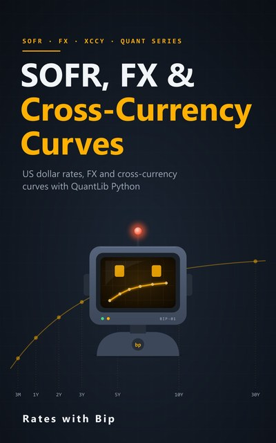

# SOFR, FX & Cross-Currency Curves



The US dollar money market and SOFR, AUD/USD spot, forwards and FX swaps, BBSW/SOFR cross-currency basis swaps,
and an Australian dollar curve for US dollar collateral, with QuantLib Python.
10 episodes, a notebook for each, and a book that goes with them. The sequel to
[AUD Swaps & Curves](../aud-swaps-and-curves/): it reuses that course's AONIA and BBSW curves.

Every number in the videos and the book is computed by these notebooks.

## Episodes

| # | Episode | Notebook | |
|---|---|---|---|
| 1 | **The USD Money Market**<br>The Fed's target range, EFFR and SOFR | [s2e01_usd_money_market.ipynb](notebooks/s2e01_usd_money_market.ipynb) | [](https://colab.research.google.com/github/RatesWithBip/curriculum/blob/main/sofr-fx-and-cross-currency-curves/notebooks/s2e01_usd_money_market.ipynb) |
| 2 | **How SOFR Compounds**<br>Real fixings, by hand, in QuantLib, and against the New York Fed's SOFR Index | [s2e02_sofr_compounding.ipynb](notebooks/s2e02_sofr_compounding.ipynb) | [](https://colab.research.google.com/github/RatesWithBip/curriculum/blob/main/sofr-fx-and-cross-currency-curves/notebooks/s2e02_sofr_compounding.ipynb) |
| 3 | **The SOFR Curve**<br>SOFR swaps, SOFR futures and bootstrapping in QuantLib | [s2e03_sofr_curve.ipynb](notebooks/s2e03_sofr_curve.ipynb) | [](https://colab.research.google.com/github/RatesWithBip/curriculum/blob/main/sofr-fx-and-cross-currency-curves/notebooks/s2e03_sofr_curve.ipynb) |
| 4 | **AUD/USD Spot**<br>How it's quoted, eight years of history, and the spot date | [s2e04_audusd_spot.ipynb](notebooks/s2e04_audusd_spot.ipynb) | [](https://colab.research.google.com/github/RatesWithBip/curriculum/blob/main/sofr-fx-and-cross-currency-curves/notebooks/s2e04_audusd_spot.ipynb) |
| 5 | **FX Forwards and Swaps**<br>Forward points, covered interest parity and the basis | [s2e05_fx_forwards_swaps.ipynb](notebooks/s2e05_fx_forwards_swaps.ipynb) | [](https://colab.research.google.com/github/RatesWithBip/curriculum/blob/main/sofr-fx-and-cross-currency-curves/notebooks/s2e05_fx_forwards_swaps.ipynb) |
| 6 | **Cross-Currency Basis Swaps**<br>BBSW against SOFR, notional resets, and who pays the basis | [s2e06_xccy_basis_swaps.ipynb](notebooks/s2e06_xccy_basis_swaps.ipynb) | [](https://colab.research.google.com/github/RatesWithBip/curriculum/blob/main/sofr-fx-and-cross-currency-curves/notebooks/s2e06_xccy_basis_swaps.ipynb) |
| 7 | **Collateral and Discounting**<br>Why the collateral currency decides the discount curve | [s2e07_collateral.ipynb](notebooks/s2e07_collateral.ipynb) | [](https://colab.research.google.com/github/RatesWithBip/curriculum/blob/main/sofr-fx-and-cross-currency-curves/notebooks/s2e07_collateral.ipynb) |
| 8 | **Building the Curve**<br>An AUD curve for US dollar collateral, from FX swaps and basis swaps | [s2e08_building_the_curve.ipynb](notebooks/s2e08_building_the_curve.ipynb) | [](https://colab.research.google.com/github/RatesWithBip/curriculum/blob/main/sofr-fx-and-cross-currency-curves/notebooks/s2e08_building_the_curve.ipynb) |
| 9 | **Pricing with the Curves**<br>Long-dated FX forwards and an off-market basis swap | [s2e09_pricing.ipynb](notebooks/s2e09_pricing.ipynb) | [](https://colab.research.google.com/github/RatesWithBip/curriculum/blob/main/sofr-fx-and-cross-currency-curves/notebooks/s2e09_pricing.ipynb) |
| 10 | **Risk**<br>What a basis swap and an FX forward are exposed to, and how to hedge | [s2e10_risk.ipynb](notebooks/s2e10_risk.ipynb) | [](https://colab.research.google.com/github/RatesWithBip/curriculum/blob/main/sofr-fx-and-cross-currency-curves/notebooks/s2e10_risk.ipynb) |

## The book

[**SOFR, FX & Cross-Currency Curves** (PDF, 62 pages)](book/SOFR-FX-and-Cross-Currency-Curves.pdf): one chapter per episode, with the derivations, the hand
checks next to QuantLib's results, and the sources for every market convention.

## Run the notebooks

**In Google Colab**, nothing to install: click its **Open in Colab** button above. The first cells install
QuantLib 1.43 and write the data the notebook reads. Then run the cells in order.

**On your own computer:**

```bash
pip install -r requirements.txt
jupyter lab notebooks/
```

Tested with Python 3.14, QuantLib 1.43, pandas 3.0, numpy 2.5 and matplotlib 3.11. Running a notebook writes its data
files and an `outputs.json` next to it; git ignores them.

## Data

- The SOFR swap, SOFR futures, FX swap, cross-currency basis and AUD swap quotes are illustrative, made up for
  teaching. They are not market data.
- Episodes 1 and 2 use SOFR, EFFR (with the FOMC target range) and the SOFR Averages and Index from the Federal
  Reserve Bank of New York. The SOFR and EFFR data are subject to the Terms of Use posted at
  [newyorkfed.org](https://www.newyorkfed.org/privacy/termsofuse). The New York Fed is not responsible for publication of
  the SOFR and EFFR data by Rates with Bip, does not sanction or endorse any particular republication, and has no
  liability for your use. SOFR data are calculated using data provided under a license granted to the New York Fed by
  DTCC Solutions LLC; Solutions, its affiliates, and third parties from which they obtained data have no liability for
  the content of this material.
- Episode 4 uses the AUD/USD noon buying rates in New York from the Federal Reserve Board's H.10 release.
  Source: Board of Governors of the Federal Reserve System.

Rates with Bip is not affiliated with the New York Fed. The New York Fed does not sanction, endorse, or recommend any products or services offered by Rates with Bip.

## Sources

Market conventions follow the New York Fed and the ARRC (SOFR), CME's SOFR futures rules as filed with the CFTC,
AFMA's *Interest Rate Derivative Conventions* and its BBSW/SOFR cross-currency term sheet, the RBA, the BIS and
QuantLib's documentation. Each chapter of the book lists the sources it relies on. Conventions change: check the current documents before
relying on them.

## Licence

The notebooks are under the [MIT licence](../LICENSE). The book and its cover are under
[CC BY-NC-ND 4.0](../LICENSE-BOOKS.md): share them freely, unchanged, with credit, for non-commercial purposes.
The New York Fed and Federal Reserve Board data in Episodes 1, 2 and 4 remain subject to their publishers' terms.

## Support

Everything here is free and stays free. If it helped you, you can buy Bip a coffee:

[](https://ko-fi.com/rateswithbip)

## Disclaimer

For education only. Nothing here is financial, investment, legal or tax advice.
